# ECSCM-Git

**WARNING**: ECSCM-Git has been deprecated and is no longer supported.
It has been replaced by IMPORTANT: This plugin is deprecated, please use
a new one — [Git
plugin](https://docs.cloudbees.com/docs/cloudbees-cd-plugin-docs/latest/ec-git/),
[GitHub
plugin](https://docs.cloudbees.com/docs/cloudbees-cd-plugin-docs/latest/ec-github/),
and [Bitbucket
plugin](https://docs.cloudbees.com/docs/cloudbees-cd-plugin-docs/latest/ec-bitbucket/).

Git is a distributed revision control system distributed under the terms
of the GNU General Public License version 2. Every Git working directory
is a full-fledged repository with complete history and full revision
tracking capabilities, not dependent on network access or a central
server.

The Git plugin connects the Git source control server to CloudBees CD/RO
to enable:

-   Code checkouts

-   Preflight build

-   Continuous integration

Refer to the [Git technical
documentation](http://git-scm.com/documentation) for more information.

# Compile

Run gradlew to compile the plugin

# Integrated version

This plugin was developed and tested with Git version 1.8.3.1.

# Plugin configuration

Plugin configurations are sets of parameters that apply across some or
all the plugin’s procedures. They are intended to reduce repetition
of common values, create predefined sets of parameters for end users,
and to securely store credentials where needed. Each configuration is
given a unique name that is entered in designated parameters on
procedures that use them.

## Configuration parameters 

<table>
<colgroup>
<col style="width: 50%" />
<col style="width: 50%" />
</colgroup>
<thead>
<tr class="header">
<th style="text-align: left;">Parameter</th>
<th style="text-align: left;">Description</th>
</tr>
</thead>
<tbody>
<tr class="odd">
<td style="text-align: left;">
SCM Type
</td>
<td style="text-align: left;">
Select the SCM Type, in this case
"Git". (Required)
</td>
</tr>
<tr class="even">
<td style="text-align: left;">
Configuration
</td>
<td style="text-align: left;">
Provide a unique name for the
configuration, keeping in mind that you may need to create additional
configurations over time. (Required)
</td>
</tr>
<tr class="odd">
<td style="text-align: left;">
Description
</td>
<td style="text-align: left;">
You can supply a text description only
for your reference. CloudBees CD/RO does not use this
information.
</td>
</tr>
<tr class="even">
<td style="text-align: left;">
User Name
</td>
<td style="text-align: left;">
Provide the username CloudBees CD/RO
uses to communicate with the Git server.
</td>
</tr>
<tr class="odd">
<td style="text-align: left;">
Passwords
</td>
<td style="text-align: left;">
Password and Retype Password: Provide
the password for the specified User Name.
</td>
</tr>
<tr class="even">
<td style="text-align: left;">
Private Key
</td>
<td style="text-align: left;">
Enter the SSH Private Key for the git
repository.
</td>
</tr>
</tbody>
</table>

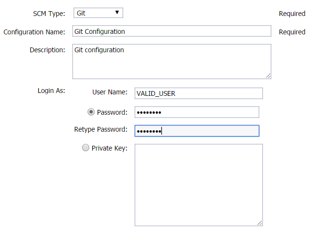

# Plugin procedures

## CollectReportingData

Collects reporting data from Git repository and sends it to CloudBees
CD/RO reporting server.

### Procedure configuration parameters

<table>
<colgroup>
<col style="width: 50%" />
<col style="width: 50%" />
</colgroup>
<thead>
<tr class="header">
<th style="text-align: left;">Parameter</th>
<th style="text-align: left;">Description</th>
</tr>
</thead>
<tbody>
<tr class="odd">
<td style="text-align: left;">
Configuration name
</td>
<td style="text-align: left;">
The name of the configuration that
contains the information required to connect to Repository.
</td>
</tr>
<tr class="even">
<td style="text-align: left;">
Preview Mode
</td>
<td style="text-align: left;">
This mode is provided to let a user
perform a WHAT IF analysis before enabling automatic reporting. If this
mode is set, no metadata will be set and reports will be not be sent to
the Reporting Server. Instead detailed information about each object
retrieved from SonarQube that includes transformation, mapping and
payload, will be shown in the summary logs.
</td>
</tr>
<tr class="odd">
<td style="text-align: left;">
Remote Repository
</td>
<td style="text-align: left;">
The path or URL to the repository to
pull from, e.g. <em>https://github.com/username/reponame</em>.
</td>
</tr>
<tr class="even">
<td style="text-align: left;">
Remote Branch
</td>
<td style="text-align: left;">
Name of the git branch to use. Default
will be master.
</td>
</tr>
<tr class="odd">
<td style="text-align: left;">
Starting commit
</td>
<td style="text-align: left;">
SHA of the earliest commit from which
data needs to be collected. Needs to be setup only for the first
run.
</td>
</tr>
<tr class="even">
<td style="text-align: left;">
File Prefix
</td>
<td style="text-align: left;">
If provided, matching string will be
removed from file path before sending report. For example if file path
is /opt/repo/file1, file prefix = /opt/repo will resolve it to /file1.
Similarly file prefix = /opt/repo/ will resolve it to file1.
</td>
</tr>
<tr class="odd">
<td style="text-align: left;">
Field Mapping
</td>
<td style="text-align: left;">
Allows user to place custom fields to
payload, or modify payload values. Examples:
"MyApplication":codeCommit.releaseName - map value "MyApplication" to
code_commit report releaseName field. Defaults to:

<pre><code>&quot;Enter-Release-Name-Here&quot;:codeCommit.releaseName,
&quot;Enter-Release-Project-Name-Here&quot;:codeCommit.releaseProjectName,
commit.commitDate: codeCommit.commitDate,
commit.scmUrl: codeCommit.scmUrl,
commit.scmRepoBranch: codeCommit.scmRepoBranch,
commit.commitId: codeCommit.commitId,
commit.author: codeCommit.author,
commit.commitMessage: codeCommit.commitMessage,
commit.codeLinesAdded: codeCommit.codeLinesAdded,
commit.codeLinesUpdated: codeCommit.codeLinesUpdated,
commit.codeLinesRemoved: codeCommit.codeLinesRemoved,
commit.filesAdded: codeCommit.filesAdded,
commit.filesUpdated: codeCommit.filesUpdated,
commit.filesRemoved: codeCommit.filesRemoved,
# CodeCommitFile section
commit.scmUrl: codeCommitFile.scmUrl,
commit.scmRepoBranch: codeCommitFile.scmRepoBranch,
commit.commitId: codeCommitFile.commitId,
commit.sourceUrl: codeCommitFile.sourceUrl,
commitFile.filePath: codeCommitFile.filePath,
commitFile.codeLinesAdded: codeCommitFile.codeLinesAdded,
commitFile.codeLinesUpdated: codeCommitFile.codeLinesUpdated,
commitFile.codeLinesRemoved: codeCommitFile.codeLinesRemoved</code></pre></td>
</tr>
<tr class="even">
<td style="text-align: left;">
Transform Script
</td>
<td style="text-align: left;">
Allows user to provide perl script for
payload customization. This method will be invoked by plugin with 2
parameters. 1st parameter is context object, 2nd is payload object.
Method should be named "transform", and should return payload object. In
this example myTimestamp field will be added to payload object:

<pre><code>sub transform {
    my ($context, $payload) = @_;
    # $payload-&gt;{codeCommit}-&gt;{customField1} = $context-&gt;one();
&#10;    # for my $p (@{$payload-&gt;{codeCommitFile}}) {
    #    $p-&gt;{customField2} = $context-&gt;one();
    # }
    return $payload;
}
sub one {
    my ($context) = @_;
    return time();
}</code></pre></td>
</tr>
<tr class="odd">
<td style="text-align: left;">
Metadata Property Path
</td>
<td style="text-align: left;">
Property sheet where run metadata will
be stored. Optional field. If omited,
/mySchedule/ECSCM-Git-%JobName%-%Report Object Type% will be used for
schedule contest. For all other contexts root is /myProject.
</td>
</tr>
<tr class="even">
<td style="text-align: left;">
Commit URL Template
</td>
<td style="text-align: left;">
Template for a commit URL to be
included in the report. Available substitutions:

<table>
<colgroup>
<col style="width: 50%" />
<col style="width: 50%" />
</colgroup>
<thead>
<tr class="header">
<th style="text-align: left;">Pattern</th>
<th style="text-align: left;">Substitution</th>
</tr>
</thead>
<tbody>
<tr class="odd">
<td style="text-align: left;">
${repoUrl}
</td>
<td style="text-align: left;">
Repository URL as given in "Remote
Repository"
</td>
</tr>
<tr class="even">
<td style="text-align: left;">
${branch}
</td>
<td style="text-align: left;">
Repository URL as given in "Remote
Branch"
</td>
</tr>
<tr class="odd">
<td style="text-align: left;">
${commitId}
</td>
<td style="text-align: left;">
Commit hash
</td>
</tr>
</tbody>
</table></td>
</tr>
<tr class="odd">
<td style="text-align: left;">
File URL Template
</td>
<td style="text-align: left;">
Template for a specific file URL to be
included in the report. Available substitutions:

<table>
<colgroup>
<col style="width: 50%" />
<col style="width: 50%" />
</colgroup>
<thead>
<tr class="header">
<th style="text-align: left;">Pattern</th>
<th style="text-align: left;">Substitution</th>
</tr>
</thead>
<tbody>
<tr class="odd">
<td style="text-align: left;">
${repoUrl}
</td>
<td style="text-align: left;">
Repository URL as given in "Remote
Repository"
</td>
</tr>
<tr class="even">
<td style="text-align: left;">
${branch}
</td>
<td style="text-align: left;">
Repository URL as given in "Remote
Branch"
</td>
</tr>
<tr class="odd">
<td style="text-align: left;">
${commitId}
</td>
<td style="text-align: left;">
Commit hash
</td>
</tr>
<tr class="even">
<td style="text-align: left;">
${fileName}
</td>
<td style="text-align: left;">
File name and path relative to the
repository root
</td>
</tr>
</tbody>
</table></td>
</tr>
<tr class="even">
<td style="text-align: left;">
Include File Details
</td>
<td style="text-align: left;">
If set, the report will include file
details.
</td>
</tr>
<tr class="odd">
<td style="text-align: left;">
Debug
</td>
<td style="text-align: left;">
If set, the summary logs will be
written with the highest verbosity for the entire procedure.
</td>
</tr>
</tbody>
</table>

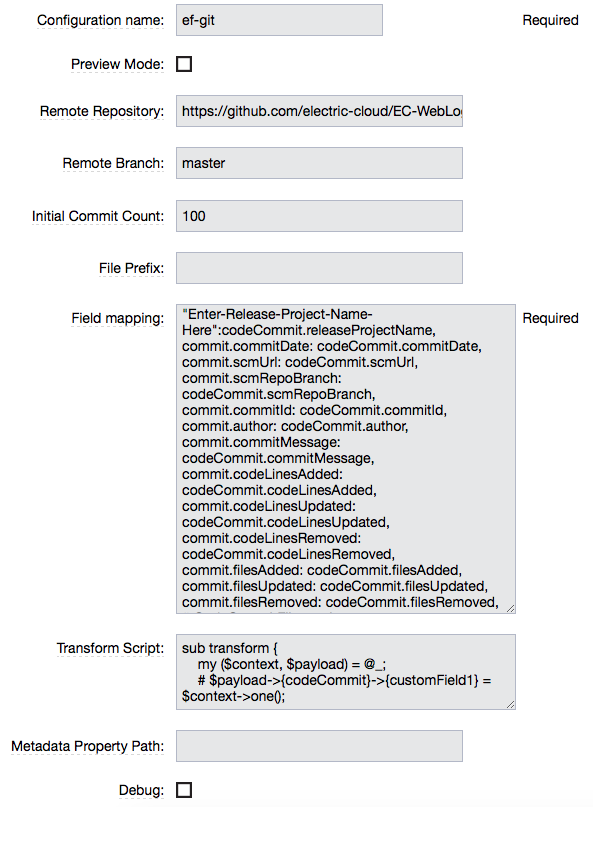

## CheckoutCode

Download a private copy of the latest version of the project, i.e. a
working copy in our computer.

<table>
<colgroup>
<col style="width: 50%" />
<col style="width: 50%" />
</colgroup>
<thead>
<tr class="header">
<th style="text-align: left;">Parameter</th>
<th style="text-align: left;">Description</th>
</tr>
</thead>
<tbody>
<tr class="odd">
<td style="text-align: left;">
Configuration
</td>
<td style="text-align: left;">
The name of a saved SCM configuration.
(Required)
</td>
</tr>
<tr class="even">
<td style="text-align: left;">
Destination Directory
</td>
<td style="text-align: left;">
Indicate the path where the source tree
will be created (can be relative to the job’s workspace).
</td>
</tr>
<tr class="odd">
<td style="text-align: left;">
Commit Hash
</td>
<td style="text-align: left;">
The Commit Hash to update the index.
Note: This will move the HEAD.
</td>
</tr>
<tr class="even">
<td style="text-align: left;">
Remote Branch
</td>
<td style="text-align: left;">
The name of the Git branch to use.
i.e.: <em>experimental</em>.
</td>
</tr>
<tr class="odd">
<td style="text-align: left;">
Clone?
</td>
<td style="text-align: left;">
This option will clone a repo into a
newly created directory.
</td>
</tr>
<tr class="even">
<td style="text-align: left;">
Overwrite?
</td>
<td style="text-align: left;">
This option will overwrite a repository
if it already exists.
</td>
</tr>
<tr class="odd">
<td style="text-align: left;">
Depth
</td>
<td style="text-align: left;">
Create a shallow clone with a history
truncated to the specified number of revisions.
</td>
</tr>
<tr class="even">
<td style="text-align: left;">
Tag
</td>
<td style="text-align: left;">
Provide the name of a specific tag to
checkout after the clone command.
</td>
</tr>
<tr class="odd">
<td style="text-align: left;">
Remote Repository
</td>
<td style="text-align: left;">
The path or URL to the repository to
pull from. i.e.: <em>git://server/repo.git</em>.
</td>
</tr>
</tbody>
</table>

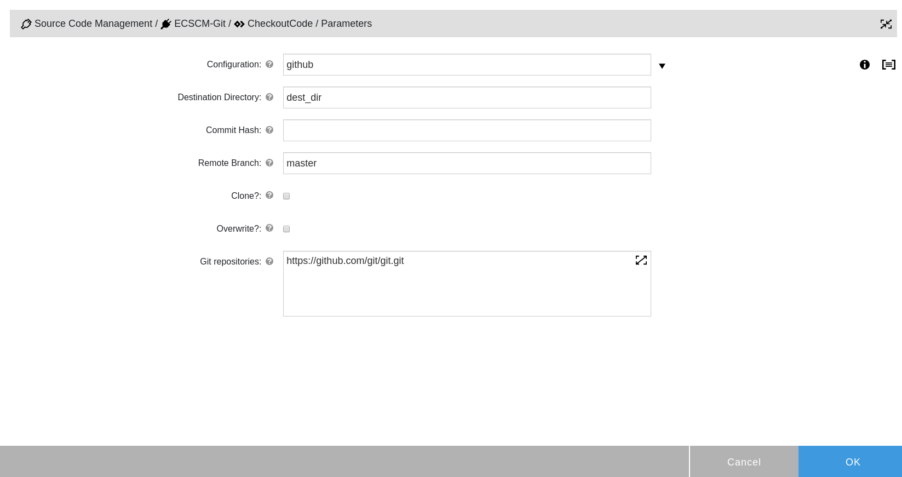

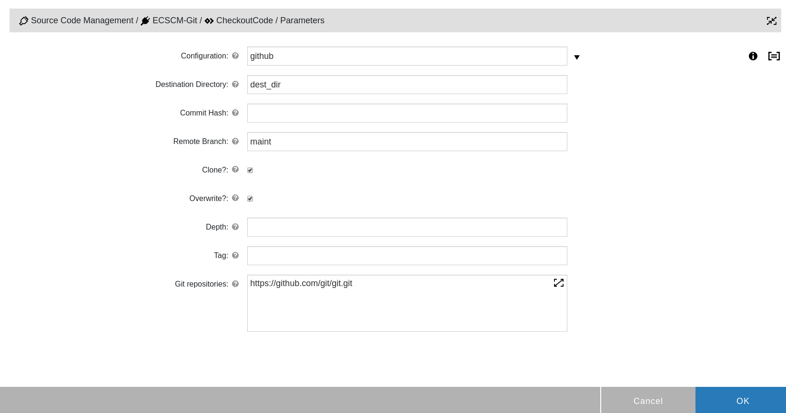

## Sentry schedule

This procedure is used for Continuous Integration. This will monitor the
repository to discover whether something changed, and trigger a
preconfigured procedure.

<table>
<colgroup>
<col style="width: 50%" />
<col style="width: 50%" />
</colgroup>
<thead>
<tr class="header">
<th style="text-align: left;">Parameter</th>
<th style="text-align: left;">Description</th>
</tr>
</thead>
<tbody>
<tr class="odd">
<td style="text-align: left;">
Remote Repository
</td>
<td style="text-align: left;">
If specified, the local repository will
be updated from the remote repository before the git log command. i.e.:
<em>git://server/repo.git</em>.
</td>
</tr>
<tr class="even">
<td style="text-align: left;">
Local Repository
</td>
<td style="text-align: left;">
The directory of the local
repository.
</td>
</tr>
<tr class="odd">
<td style="text-align: left;">
Branch
</td>
<td style="text-align: left;">
The name of the Git branch to use.
i.e.: <em>experimental</em>.(Required)
</td>
</tr>
<tr class="even">
<td style="text-align: left;">
Quiet time minutes
</td>
<td style="text-align: left;">
The number of minutes of no check-in
activity required before launching the procedure.
</td>
</tr>
<tr class="odd">
<td style="text-align: left;">
Use ls-remote
</td>
<td style="text-align: left;">
If checked, it will use the Git option
ls-remote to check for new changes.

You may use this option to avoid full pulls and increase the
performance.

<strong>Note:</strong> If you enable this option the sentry will
ignore the "Quiet time minutes" parameter and execute procedures every
time there is a new change.
</td>
</tr>
<tr class="even">
<td style="text-align: left;">
Enabled for ElectricSentry
</td>
<td style="text-align: left;">
Enable this schedule for
ElectricSentry.
</td>
</tr>
<tr class="odd">
<td style="text-align: left;">
Run Schedule Even if Another Instance
is Running
</td>
<td style="text-align: left;">
If checked, the schedule will be
launched even if the another instance of this schedule is already
running. By default it will skip a new run (this was done in order to
deal with series of commits).
</td>
</tr>
</tbody>
</table>

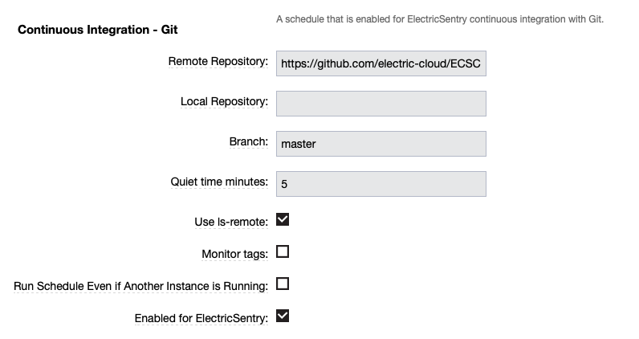

## Preflight (agent side)

This will execute the agent side of the preflight.

<table>
<colgroup>
<col style="width: 50%" />
<col style="width: 50%" />
</colgroup>
<thead>
<tr class="header">
<th style="text-align: left;">Parameter</th>
<th style="text-align: left;">Description</th>
</tr>
</thead>
<tbody>
<tr class="odd">
<td style="text-align: left;">
Configuration Name
</td>
<td style="text-align: left;">
The name of a saved SCM configuration.
(Required)
</td>
</tr>
<tr class="even">
<td style="text-align: left;">
Destination Directory
</td>
<td style="text-align: left;">
Indicate the path where the source tree
will be created (can be relative to the job’s workspace).
</td>
</tr>
<tr class="odd">
<td style="text-align: left;">
Remote Repository
</td>
<td style="text-align: left;">
The path or URL to the repository that
preflight will pull from before overlaying files. (Required)
</td>
</tr>
</tbody>
</table>

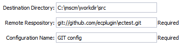

### Preflight (client side)

This will execute the client part of the preflight.

These parameters can be set in the .preflight file, or passed directly
to the ecclientpreflight tool.

<table>
<colgroup>
<col style="width: 50%" />
<col style="width: 50%" />
</colgroup>
<thead>
<tr class="header">
<th style="text-align: left;">Parameter</th>
<th style="text-align: left;">Description</th>
</tr>
</thead>
<tbody>
<tr class="odd">
<td style="text-align: left;">
gituser
</td>
<td style="text-align: left;">
The value of GITUSER. May also be set
in the environment or using git set.
</td>
</tr>
<tr class="even">
<td style="text-align: left;">
gitpassword
</td>
<td style="text-align: left;">
The value of GITPASSWORD. May also be
set in the environment or using git set.
</td>
</tr>
<tr class="odd">
<td style="text-align: left;">
gitclient
</td>
<td style="text-align: left;">
The value of GITCLIENT.May also be set
in the environment or using git set. (Required)
</td>
</tr>
<tr class="even">
<td style="text-align: left;">
gitdir
</td>
<td style="text-align: left;">
The Git directory to process.
(Required)
</td>
</tr>
<tr class="odd">
<td style="text-align: left;">
method
</td>
<td style="text-align: left;">
The type of preflight to run. Values
are:

<ol type="1">
<li>
local_all: get tracked and untracked changes between working tree
and local repo.
</li>
<li>
local_tracked: get tracked changes between working tree and local
repo.
</li>
<li>
remote: get all changes between working tree and remote
repo.
</li>
</ol></td>
</tr>
</tbody>
</table>

    <?xml version="1.0" encoding="utf-8"?>
    <data>
        <server>
            <hostName>localhost</hostName>
            <userName>admin</userName>
            <password>123</password>
        </server>
        <procedure>
            <projectName>Git</projectName>
            <procedureName>Preflight</procedureName>
            <parameter>
            <name>preflight</name>
            <value>1</value>
            </parameter>
            <jobTimeout>7200</jobTimeout>
        </procedure>
        <scm>
            <type>ECSCM-Git</type>
            <user>build</user>
            <gitdir>C:/Repo/</gitdir>
            <method>local_all</method>
        </scm>
    </data>

# Webhooks

General information pertaining to Webhook Triggers can be found in the
[Event-Based
Triggers](https://docs.cloudbees.com/docs/cloudbees-flow/latest/pipelines/event-based-triggers#_webhook_triggers)
section of CloudBees CD/RO Documentation. This section provides
information on what is required in the plugin configuration for a
Webhook trigger.

## GitHub webhook

A Pipeline or Release can be triggered by GitHub webhook.

In order to configure GitHub Webhook Trigger:

-   Create a new trigger for Pipeline or Release

-   Choose previously created configuration for ECSCM-Git plugin

-   Choose "Webhook" trigger type

-   Fill all the required fields

Webhook Secret: if you are using a secret in your Webhook configuration,
this secret can be provided when creating plugin configuration:

<table>
<colgroup>
<col style="width: 50%" />
<col style="width: 50%" />
</colgroup>
<thead>
<tr class="header">
<th style="text-align: left;">Parameter</th>
<th style="text-align: left;">Description</th>
</tr>
</thead>
<tbody>
<tr class="odd">
<td style="text-align: left;">
Repository Name
</td>
<td style="text-align: left;">
Repository name, e.g. user/repository.
Should be provided in form &lt;user-name&gt;/&lt;repository-name&gt; or
&lt;org-name&gt;/&lt;repository-name&gt;.
</td>
</tr>
<tr class="even">
<td style="text-align: left;">
Event Type
</td>
<td style="text-align: left;">
Type of event. For now only
<strong>push</strong> event is supported.
</td>
</tr>
<tr class="odd">
<td style="text-align: left;">
Event Source
</td>
<td style="text-align: left;">
The source of the event. For now only
<strong>GitHub</strong> and <strong>Bitbucket</strong> are
supported.
</td>
</tr>
<tr class="even">
<td style="text-align: left;">
Branch
</td>
<td style="text-align: left;">
Name of the branch to trigger webhook,
e.g. master.
</td>
</tr>
<tr class="odd">
<td style="text-align: left;">
Run Schedule Even if Another Instance
is Running
</td>
<td style="text-align: left;">
If checked, the schedule will be
launched even if another instance of this schedule is already
running.
</td>
</tr>
<tr class="even">
<td style="text-align: left;">
Quiet Time
</td>
<td style="text-align: left;">
How many seconds should CloudBees CD/RO
wait before launching the schedule?
</td>
</tr>
<tr class="odd">
<td style="text-align: left;">
Maximum Retries
</td>
<td style="text-align: left;">
How many times the schedule launch will
be postponed?
</td>
</tr>
</tbody>
</table>

## Bitbucket webhook

A Pipeline or Release can be triggered by Bitbucket webhook.

In order to configure Bitbucket Webhook Trigger:

-   Create a new trigger for Pipeline or Release

-   Choose previously created configuration for ECSCM-Git plugin

-   Choose "Webhook" trigger type

-   Fill all the required fields

Webhook Secret: a secret is not used by Bitbucket Webhook.

<table>
<colgroup>
<col style="width: 50%" />
<col style="width: 50%" />
</colgroup>
<thead>
<tr class="header">
<th style="text-align: left;">Parameter</th>
<th style="text-align: left;">Description</th>
</tr>
</thead>
<tbody>
<tr class="odd">
<td style="text-align: left;">
Repository Name
</td>
<td style="text-align: left;">
Repository name, e.g. user/repository.
Should be provided in form &lt;user-name&gt;/&lt;repository-name&gt; or
&lt;org-name&gt;/&lt;repository-name&gt;.
</td>
</tr>
<tr class="even">
<td style="text-align: left;">
Event Type
</td>
<td style="text-align: left;">
Type of event. For now only
<strong>push</strong> event is supported.
</td>
</tr>
<tr class="odd">
<td style="text-align: left;">
Event Source
</td>
<td style="text-align: left;">
The source the of event. For now only
<strong>GitHub</strong> and <strong>Bitbucket</strong> are
supported.
</td>
</tr>
<tr class="even">
<td style="text-align: left;">
Branch
</td>
<td style="text-align: left;">
Name of the branch to trigger webhook,
e.g. master.
</td>
</tr>
<tr class="odd">
<td style="text-align: left;">
Run Schedule Even if Another Instance
is Running
</td>
<td style="text-align: left;">
If checked, the schedule will be
launched even if another instance of this schedule is already
running.
</td>
</tr>
<tr class="even">
<td style="text-align: left;">
Quiet Time
</td>
<td style="text-align: left;">
How many seconds should CloudBees CD/RO
wait before launching the schedule?
</td>
</tr>
<tr class="odd">
<td style="text-align: left;">
Maximum Retries
</td>
<td style="text-align: left;">
How many times the schedule launch will
be postponed?
</td>
</tr>
</tbody>
</table>

# ACL setup for webhook

The service account created by default may not have all the permissions
required to trigger a pipeline based on a Webhook. The following DSL is
provided as an example to set up the necessary permissions for a service
account to work with a Webhook trigger.

    // Set ACL
    //
    // Change accountName, pipelineName and projectName values
    // according to your trigger webhook setup
    //
    def accountName = "sampleServiceAccountName"
    def pipelineName = "samplePipelineName"
    def projectName = "Default"

    def properties = [
        '/server/ec_endpoints',
        '/plugins/ECSCM-Git/project/ec_endpoints/githubWebhook/POST',
        '/plugins/ECSCM-Git/project/ec_endpoints/githubWebhook/POST/configurationMetadata',
        '/plugins/ECSCM/project/scm_cfgs',
    ]

    properties.each { property ->
        aclEntry readPrivilege: 'allow',
            path: property,
            principalName: accountName,
            objectType: 'propertySheet',
            principalType: 'serviceAccount'
    }

    aclEntry readPrivilege: 'allow',
        projectName: '/plugins/ECSCM/project',
        principalName: accountName,
        objectType: 'project',
        principalType: 'serviceAccount'

    aclEntry modifyPrivilege: 'allow',
        projectName: '/plugins/ECSCM/project',
        principalName: accountName,
        objectType: 'project',
        principalType: 'serviceAccount'

    aclEntry executePrivilege: 'allow',
        projectName: '/plugins/ECSCM/project',
        principalName: accountName,
        objectType: 'procedure',
        principalType: 'serviceAccount',
        procedureName: 'ProcessWebHookSchedules'

    aclEntry readPrivilege: 'allow',
        systemObjectName: 'server',
        principalName: accountName,
        objectType: 'systemObject',
        principalType: 'serviceAccount',
        procedureName: 'ProcessWebHookSchedules'

    def ecscmProjectName = getPlugin(pluginName: 'ECSCM')?.project?.projectName

    aclEntry modifyPrivilege: 'allow',
        readPrivilege: 'allow',
        objectType: 'propertySheet',
        path: '/server/ec_counters',
        principalName: 'project: ' + ecscmProjectName,
        principalType: 'user'

    aclEntry modifyPrivilege: 'allow',
        readPrivilege: 'allow',
        objectType: 'propertySheet',
        path: '/server/ec_counters',
        principalName: accountName,
        principalType: 'serviceAccount'

    //Grant permissions to the plugin project
    def objTypes = ['resources', 'workspaces'];

    objTypes.each { type ->
        aclEntry principalType: 'user',
            principalName: "project: " + ecscmProjectName,
            systemObjectName: type,
            objectType: 'systemObject',
            readPrivilege: 'allow',
            modifyPrivilege: 'allow',
            executePrivilege: 'allow',
            changePermissionsPrivilege: 'allow'
    }

    // Grant permissions to the pipeline
     aclEntry executePrivilege: 'allow',
         projectName: projectName,
         principalName: accountName,
         objectType: 'pipeline',
         principalType: 'serviceAccount',
         pipelineName: pipelineName

## updateLastGoodAndLastCompleted

If the job’s outcome is successful, updates a last successful snapshot
property to the revision used in the job.

<table>
<colgroup>
<col style="width: 50%" />
<col style="width: 50%" />
</colgroup>
<thead>
<tr class="header">
<th style="text-align: left;">Parameter</th>
<th style="text-align: left;">Description</th>
</tr>
</thead>
<tbody>
<tr class="odd">
<td style="text-align: left;">
The configuration name
</td>
<td style="text-align: left;">
The name of the configuration that
contains the information required to connect to Repository.
</td>
</tr>
</tbody>
</table>

This procedure should be called in the last step after
"**CheckoutCode**".

For instance, the first step "checkout" (**CheckoutCode**) clones the
repository and fills up the property sheet
"**/myJob/ecscm\_snapshots**".

The last step "update" (**updateLastGoodAndLastCompleted**) copies data
from the property sheet "/myJob/ecscm\_snapshots" to the properties
"**/myProcedure/ecscm\_snapshots/lastCompleted**" and
"**/myProcedure/ecscm\_snapshots/lastGood**".

# Examples and use cases

## Configure a checkout

In the create step pop-up, select the tab "SCM", from this tab select
the "Git - Checkout" type and click OK

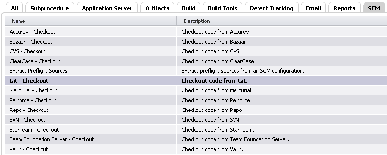

Fill the form, in this example we are using a configuration called "GIT
config" and a remote repository in a remote server named
"git@bitbucket.org".

The procedure now should look like this one, you can run now.

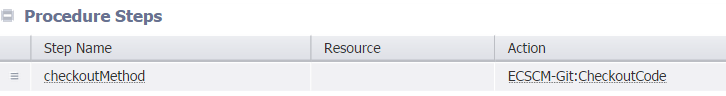

If everything was properly set now you should see something like this.

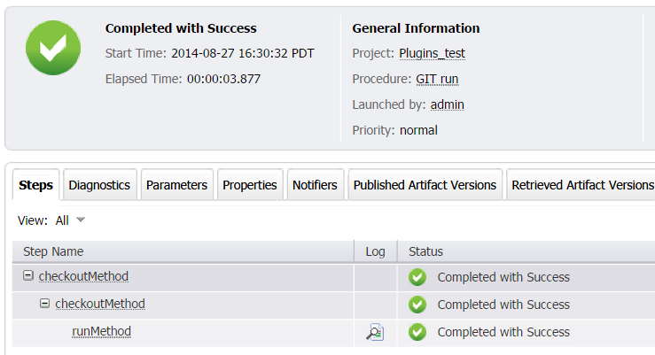

If you see everything green, the procedure worked fine, so you can now
take a look at the logs. If you click on the log, for the CheckOutMethod
subprocedure "runMethod", you will see something like this.

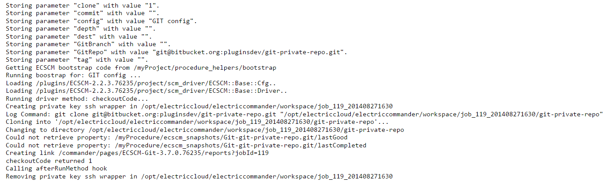

## Preflight

### Configuring the preflight

In the "Procedure Details" where the steps are created, in the "New
Step" section, select the plugin link and then search "ECSCM-Git -
Preflight" and select it from the list.

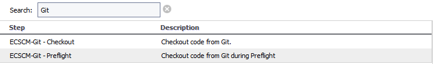

Provide the Git configuration that you want to use, we chose GIT config.
Select a destination directory and remote repository.

The procedure should look like this.

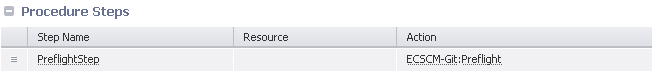

### Running the preflight

From the command line use the "ecclientpreflight" tool to run a
preflight. In this example we used the option -c to use the
configuration file called "Git.preflight", if the file is named
".preflight" you don’t need to specify a name.

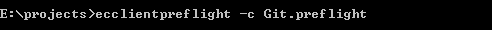

The "ecclientpreflight" tool will ask for the user and password included
in the "Git.preflight" file, then you will see how it copies all the
files in the changelist to the server, and launches the preflight
procedure that we created earlier.

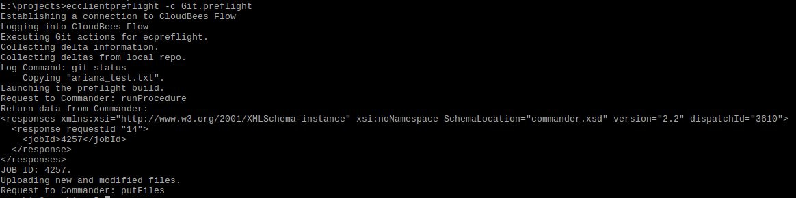

If you go to the CloudBees CD/RO jobs tab, you will see our recently
launched job.

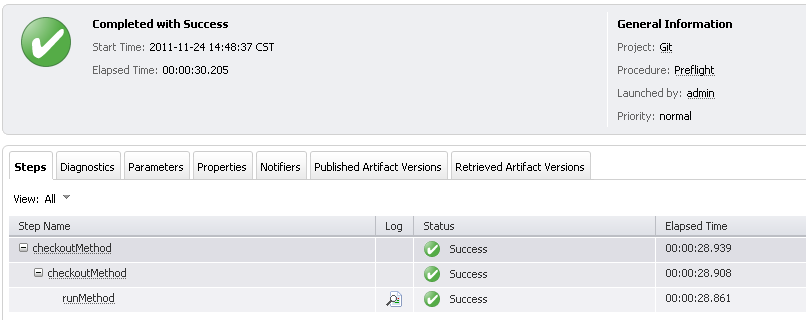

In the preflight step, you will see the runMethod substep, check the log
for this substep.

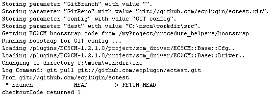

# Configuring a sentry schedule form

In the project, select the "schedules" tab, then in the pop-up select
the "SCM" type.

Select a step name, in this case we used "Components-sentry", also
select a Git configuration. Then you should select the procedure that
will be run when the sentry is triggered. In this case we chose the
project "runWithSentry" and the procedure name inside the project called
"runWithSentry"

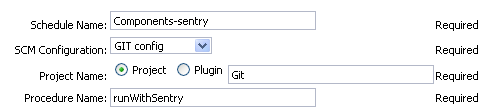

After that you should fill the form, to inform the sentry monitor, which
client we need to monitor. In this example we want to monitor the branch
"experimental", this means that every time that something change in the
repository, specifically in the branch "experimental", the sentry will
trigger our "runWithSentry" procedure.

The schedule should look like this.

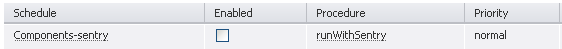

If something changes in the client "bundled-components" the sentry
monitor will display something like this if you select the job from the
jobs tab.

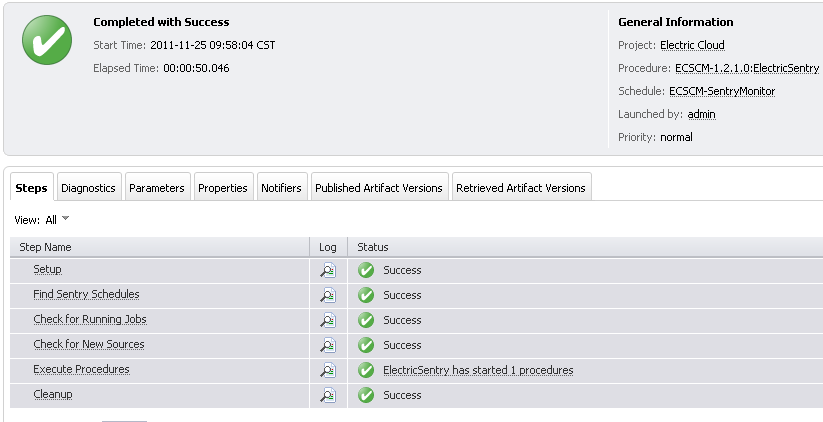

This is the log of the sentry monitor, it says that a job was started by
the schedule "Components-Sentry" in the "Git" project.

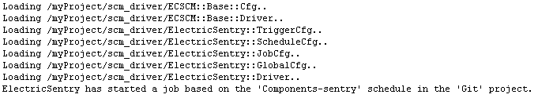

The runWithSentry job, should be visible now from the jobs tab.

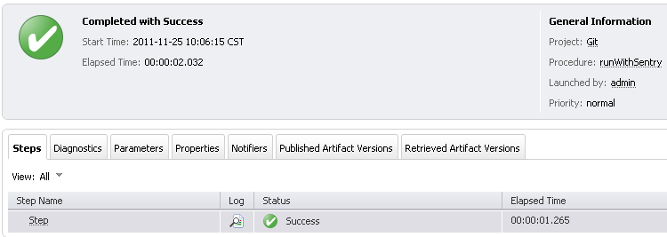

# Known issues

-   In situations other than Normal Running mode, i.e., one of Preview or
    Debug is enabled, the CollectReportingData could return the summary
    status of an error just based on certain patterns found in logging.
    For example, a commit message that says "Fixed Segmentation Fault.."
    could return the summary status of error. However, in all these
    cases, except for the summary status, the procedure would perform
    its intended action correctly.

# Release notes

## ECSCM-Git 3.12.4

-   Migrated to community.

## ECSCM-Git 3.12.2

-   Fixed an issue with missing property credentialType during upgrade.

-   The documentation has been migrated to the main documentation site.

## ECSCM-Git 3.12.1

-   Rebranding to "CloudBees CD/RO".

## ECSCM-Git 3.12.0

-   Support added for BitBucket Webhook.

## ECSCM-Git 3.11.1

-   The previous version has a bug in Preflight functionality related to
    the extra modules loading from the eclientpreflight CLI "Can’t
    locate English.pm in @INC". The imports have been removed and the
    preflight CLI has been fixed.

## ECSCM-Git 3.11.0

-   Added "Overwrite" switch for the `CheckoutCode` procedure.

## ECSCM-Git 3.10.0

-   Switched `CheckoutCode` procedure from GWT to React.

-   Fixed issue with single changelog link for multiple checkouts from
    multiple repositories in one single procedure.

-   Changelogs were switched to pre-generated HTML pages and stored in
    the artifacts in the job workspace.

## ECSCM-Git 3.9.1

-   Renaming to "CloudBees".

-   Issue when the form did not load properly in pipeline context has
    been fixed.

-   Wrong required formal parameters count display during task
    definition in pipeline for CollectReportingData has been fixed.

## ECSCM-Git 3.9.0

-   GitHub Webhook support has been added.

-   Option "Run Schedule Even if Another Instance is Running" has been
    added for Sentry schedules.

## ECSCM-Git 3.8.1

-   CollectReportingData procedure now does not report file details by
    default

-   CollectReportingData procedure now has an option "Include File
    Details" to include file details in the report

-   CollectReportingData procedure now supports templates for file and
    commit URLs

-   Logo icon has been added.

## ECSCM-Git 3.8.0

-   A new procedure called CollectReportingData has been added in order
    to support predictive analytics.

## ECSCM-Git 3.7.4

-   Fixed UI page rendering hang on editing plugin parameters in case
    GitRepo parameter is missed.

## ECSCM-Git 3.7.3

-   Added committer’s email in changelog.

-   Fix branch name validation in driver.

-   Fix client preflight for local\_all method.

-   Fix error with changelog generation when multiple Checkout step
    called with different branches from procedure.

-   Added *Clone* option to preflight and CI procedures.

## ECSCM-Git 3.7.2

-   Added correct behavior for ssh:// repositories handling.

## ECSCM-Git 3.7.1

-   Added cleanupHandler method for new ECSCM hook mechanism.

## ECSCM-Git 3.7.0

-   Add SSH private key authentication (Linux agents only).

## ECSCM-Git 3.6.0

-   Add a depth option to the CheckoutCode procedure for use in git
    clone.

-   Change the input field for the repositories field in the
    CheckoutCode procedure to a text area.

-   Fixed a bug in git changelog. The changelog will contain all changes
    between two sentry builds.

-   The CheckoutCode procedure now creates a link to the changelog in
    the *Links* section on the Job Details page.

## ECSCM-Git 3.5.0

-   Mask passwords in all git command output (STDOUT and STDERR).

-   Fix bug where repositories like *git@example.org:foo/bar.git* caused
    partial commands to be printed.

-   Fixed bug where selecting *Use ls-remote* for sentry resulted in a
    git pull. If you wish to perform a git pull during CI or need the
    ecscm\_changelogs property, deselect this option.

-   Fixed bug where the *CheckoutCode* procedure retrieved code to the
    root directory regardless of any user input.

## ECSCM-Git 3.3.0

-   Fixed bug in CheckoutCode procedure where cloning a repository by
    tag passed the tag as a branch.

## ECSCM-Git 3.2.0

-   Fixed bug where the plugin was ignoring errors when running git
    commands and relying on postp to catch errors.

-   Allow clone to work with git versions prior to 1.6.2.

## ECSCM-Git 3.1.2

-   Improve logs in sentry procedure.

-   ecscm\_changelogs property is set when using the ls-remote option in
    sentry procedure.

## ECSCM-Git 3.1.1

-   Improves to "Tag" and "Commit Hash" validations for multiple
    repositories.

-   Added the "Tag" parameter with the pull option.

## ECSCM-Git 3.1.0

-   Added the possibility to use "clone" instead of "pull" to perform
    checkout.

-   Added the "Tag" parameter with the clone option.

-   Added the "Commit Hash" parameter to provide the Git "reset" option.

## ECSCM-Git 3.0.0

-   Multiple git repositories is now possible in the checkout procedure.

## ECSCM-Git 2.0.8

-   With some git urls the plugin was unable to inject credentials in
    the git pull command.

## ECSCM-Git 2.0.7

-   Fixed bug when running the sentry with the ls-remote option.

-   Changelogs were improved.

## ECSCM-Git 2.0.6

-   Add branch names validation.

## ECSCM-Git 2.0.5

-   Step chooser name cleanup

## ECSCM-Git 2.0.4

-   Included the Preflight step.

## ECSCM-Git 2.0.3

-   Improves to the help page document.

-   The "ls-remote" parameter was added to the Sentry Schedule.

-   Fixed issue with the "git log" command with a different branch than
    "master"

## ECSCM-Git 2.0.2

-   Improve xml parameter panels.

-   New help page format.

## ECSCM-Git 1.2.2

-   Updated help page

## ECSCM-Git 1.2.1

-   Small bug fixes

## ECSCM-Git 1.2.0

-   Implements updateLastGoodAndLastCompleted procedure

-   Support for changelog

## ECSCM-Git 1.1.3

-   Updated help page

## ECSCM-Git 1.1.2

-   Added credentials

## ECSCM-Git 1.1.1

-   SCM features - Sentry

-   SCM features - Checkout

-   SCM features - Preflight
